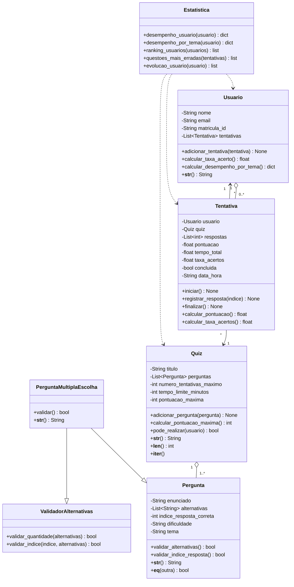

# UML - Sistema de Quiz Educacional

```mermaid
classDiagram

    class Pergunta {
        -String enunciado
        -List~String~ alternativas
        -int indice_resposta_correta
        -String dificuldade
        -String tema
        +validar_alternativas() bool
        +validar_indice_resposta() bool
        +__str__() String
        +__eq__(outra) bool
    }

    class ValidadorAlternativas {
        +validar_quantidade(alternativas) bool
        +validar_indice(indice, alternativas) bool
    }

    class PerguntaMultiplaEscolha {
        +validar() bool
        +__str__() String
    }

    class Quiz {
        -String titulo
        -List~Pergunta~ perguntas
        -int numero_tentativas_maximo
        -int tempo_limite_minutos
        -int pontuacao_maxima
        +adicionar_pergunta(pergunta) None
        +calcular_pontuacao_maxima() int
        +pode_realizar(usuario) bool
        +__str__() String
        +__len__() int
        +__iter__()
    }

    class Usuario {
        -String nome
        -String email
        -String matricula_id
        -List~Tentativa~ tentativas
        +adicionar_tentativa(tentativa) None
        +calcular_taxa_acerto() float
        +calcular_desempenho_por_tema() dict
        +__str__() String
    }

    class Tentativa {
        -Usuario usuario
        -Quiz quiz
        -List~int~ respostas
        -float pontuacao
        -float tempo_total
        -float taxa_acertos
        -bool concluida
        -String data_hora
        +iniciar() None
        +registrar_resposta(indice) None
        +finalizar() None
        +calcular_pontuacao() float
        +calcular_taxa_acertos() float
    }

    class Estatistica {
        +desempenho_usuario(usuario) dict
        +desempenho_por_tema(usuario) dict
        +ranking_usuarios(usuarios) list
        +questoes_mais_erradas(tentativas) list
        +evolucao_usuario(usuario) list
    }

    PerguntaMultiplaEscolha --|> Pergunta
    PerguntaMultiplaEscolha --|> ValidadorAlternativas

    Quiz "1" o-- "1..*" Pergunta
    Usuario "1" o-- "0..*" Tentativa

    Tentativa "*" --> "1" Usuario
    Tentativa "*" --> "1" Quiz

    Estatistica ..> Usuario
    Estatistica ..> Tentativa
    Estatistica ..> Quiz
```
